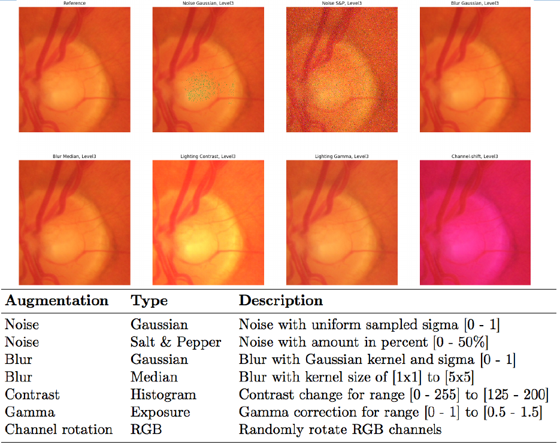

# Abouth the Project
This project is a python implementation of multiple Optical Flow methods (UNet, FlowNet) for image stitching applications. The code is implemented in Keras-TensorFlow.


## Introduction
The code contains the methods to train image pairs and their pixel-based displacement (optical flow). The mask carries the information of the pixel displacements in X and Y axis. Shifts, rotations and scaling were used for the image transformations. 


### Optical Flow - FlowNet Architecture
<div align=center></div>


### Data Augmentation
To make the model more robust, additional image manipulations are integrated.  Noise, blur and histogram manipulation are used. The values can be changed in the settings file.
<div align=center></div>

### Results on Dataset - OCT Fire
Attached is an example of the test evaluation. Here, the pixel shift between a pair of images (Reference, Moving) was estimated by the FlowNet model and the deviation was displayed as EPE error.
<div align=center></div>


# Getting Started
## Prerequisites
* Python 3.8
* Keras-Tensorflow 2.12
* OpenCV-Python 4.7
* Pandas 2.0

## Datasets
1. FIRE Fundus Image Registration Dataset [(FIRE Dataset)](https://projects.ics.forth.gr/cvrl/fire/)

## Directory Tree
* data
  * test
  * test_raw (insert images)
  * train
  * train_raw (insert images)

## Training and validation
For the results, the model was trained with 100k randomly generated patches. It is recommended to use an Nvidia GPU for the training.

In the **settings.py** file it is possible to the modify the number of patches per centroid and the number of centroids. 

```
setting.no_patches = 2         # no of patches per centroids
setting.no_centroid = 1        # no of centroids
```
Run the following script to **train** and **test** the model.
```
#Create Dataset + Train Model
python main_train.py

#Evaluate Model
python main_test.py
```

# Achnowledgements
I sincerely appreciate the authors for sharing their datasets.

* FIRE: Fundus Image Registration Dataset C. Hernandez-Matas, Journal for Modeling in Ophthalmology, Jul. 2017. <br />
DOI: 10.35119/maio.v1i4.42, (https://www.maio-journal.com/index.php/MAIO/article/view/42)
